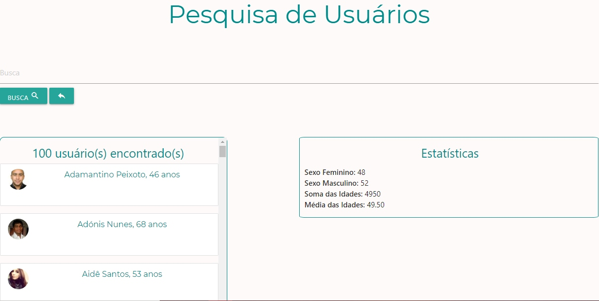

<h1 align="center">Listagem de Usuários</h1>
<h3>:computer: Sobre o projeto:</h3

Projeto criado durante o 1º módulo do bootcamp Fullstack da IGTI. Onde seu prósito era treinar funções do javascript, programação assíncrona, manipulação de arrats, treinar a lógica de programação e trabalhar com API's

<h3>:wrench: Funcionalidades</h3>
<ul>
<li>Trazer dados dos usuários de uma API, montar uma lista, ordenar pelo nome</li>
<li>Buscar usuários, seja pelo nome, sobrenome, ou apenas uma letra.</li>
<li>Somátoria das idades e dos gêneros</li>
<li>Média das idades</li>
</ul>
<h3>:calendar: Status do Projeto</h3>

Completo

<h3>:art:Layout</h3>

<strong>Se você se interessou e gostaria de testar, <a href="https://mands-codes.github.io/listagem_de_usuarios-cursoIGTI/">clique aqui</a></strong>

<h3>☑️ Tecnologias</h3>

A ferramenta a seguir foi utilizada na construção do layout do projeto

<a href="https://materializecss.com/">Materialize</a> 
<a href="https://randomuser.me/api/?seed=javascript&results=100&nat=BR&noinfo">API com os dados dos usuários</a>
